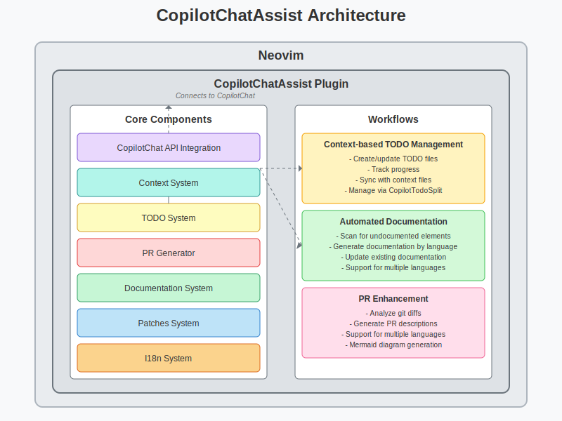

# CopilotChatAssist - Documentation

**CopilotChatAssist** is a Neovim plugin that enhances your development workflow by integrating with GitHub Copilot Chat to provide a suite of advanced features. It helps with code documentation, PR descriptions, TODO management, context tracking, and more.

## Table of Contents

- [Features](#features)
- [Architecture](#architecture)
- [Installation](#installation)
- [Configuration](#configuration)
- [Usage](#usage)
  - [TODO Management](#todo-management)
  - [PR Enhancement](#pr-enhancement)
  - [Documentation Assistant](#documentation-assistant)
  - [Context Tracking](#context-tracking)
  - [Code Patches](#code-patches)
- [Commands](#commands)
- [Troubleshooting](#troubleshooting)
- [Development](#development)

## Features

CopilotChatAssist provides the following main features:

1. **TODO Management**: Automatically create, track, and update TODO files associated with specific contexts or tickets.
2. **PR Enhancement**: Generate and improve pull request descriptions with support for multiple languages.
3. **Documentation Assistant**: Automatically generate and update code documentation for multiple languages.
4. **Context Tracking**: Keep track of project context and ticket information for better integration.
5. **Code Patches**: Process code suggestions from Copilot Chat as applicable patches.
6. **Internationalization**: Full support for English and Spanish interfaces.

## Architecture

The plugin is structured around several key components:



### Core Components

- **CopilotChat API Integration**: Provides a wrapper for communication with the CopilotChat plugin.
- **Context System**: Manages context information for tickets, projects, and tasks.
- **TODO System**: Handles the creation and management of TODO files with progress tracking.
- **PR Generator**: Creates and enhances pull request descriptions with AI assistance.
- **Documentation System**: Detects undocumented code and generates appropriate documentation.
- **Patches System**: Processes code suggestions as applicable patches.
- **I18n System**: Provides internationalization support for the user interface.

### Workflows

The plugin supports several key workflows:

1. **Context-based TODO Management**:
   - Automatically creates and updates TODO files based on context information.
   - Tracks progress and synchronizes with context files.

2. **Automated Documentation**:
   - Scans files for undocumented elements.
   - Generates appropriate documentation based on code language.
   - Updates existing documentation to match code changes.

3. **PR Enhancement**:
   - Analyzes git diffs and commit history.
   - Generates comprehensive PR descriptions.
   - Supports language switching for multilingual teams.

## Installation

```lua
-- Using packer.nvim
use {
  'username/CopilotChatAssist',
  requires = {
    'github/copilot.vim',
    'CopilotC-Nvim/CopilotChat.nvim',
  },
  config = function()
    require('copilotchatassist').setup({
      -- Your configuration options
      language = "english",  -- or "spanish"
      code_language = "english",
    })
  end
}
```

## Configuration

The plugin can be configured with the following options:

```lua
require('copilotchatassist').setup({
  -- General settings
  language = "english",      -- Interface language: "english" or "spanish"
  code_language = "english", -- Documentation language: "english" or "spanish"

  -- Logging settings
  log_level = "INFO",        -- "ERROR", "WARN", "INFO", "DEBUG", or "TRACE"

  -- TODO settings
  todo_split_orientation = "vertical", -- or "horizontal"

  -- Color highlighting for TODOs by priority
  todo_highlights = {
    "TodoHighPriority",    -- Priority 1 (highest)
    "TodoHighPriority",    -- Priority 2
    "TodoMediumPriority",  -- Priority 3
    "TodoLowPriority",     -- Priority 4
    "TodoLowPriority",     -- Priority 5 (lowest)
  },

  -- Documentation settings
  documentation = {
    languages = {
      -- Language-specific settings
      java = { enabled = true },
      lua = { enabled = true },
      ruby = { enabled = true },
      -- etc.
    }
  }
})
```

For more detailed configuration options, see [Configuration Guide](./configuration.md).

## Usage

### TODO Management

The TODO system helps you track tasks associated with specific contexts or tickets:

```vim
:CopilotGenerateTodo    " Generate TODO file from context
:CopilotTodoSplit       " Open TODO in split window
```

In the TODO split window:
- `<CR>` - View task details
- `r` - Refresh task list
- `f` - Filter by status
- `p` - Filter by priority
- `s` - Change task status
- `i` - Implement selected task
- `?` - Show help
- `q` - Close window

For more details, see [TODO System Guide](./todo_system.md).

### PR Enhancement

Enhance your PR descriptions automatically:

```vim
:CopilotEnhancePR             " Generate enhanced PR description
:CopilotChangePRLanguage      " Change language of PR description
:CopilotSimplePRLanguage      " Simple language change for PR description
```

### Documentation Assistant

Generate and manage code documentation:

```vim
:CopilotDocScan        " Scan buffer for undocumented elements
:CopilotDocSync        " Synchronize documentation (update/generate)
:CopilotDocGenerate    " Generate documentation at cursor position
:CopilotDocGitChanges  " Document elements modified according to git diff
```

### Context Tracking

Manage project and ticket context:

```vim
:CopilotTicket          " Manage ticket information
:CopilotUpdateContext   " Update context information
:CopilotProjectContext  " Get project context information
:CopilotSynthetize      " Synthesize context information
```

### Code Patches

Process code suggestions as patches:

```vim
:CopilotPatchesWindow      " Show patches window
:CopilotPatchesShowQueue   " Show patch queue
:CopilotPatchesApply       " Apply patches from queue
:CopilotPatchesClearQueue  " Clear patch queue
:CopilotPatchesProcessBuffer " Process current buffer for patches
```

## Commands

For a full list of available commands and their usage examples, see [Command Examples](./command_examples.md).

## Troubleshooting

For common issues and their solutions, see [Troubleshooting Guide](./troubleshooting.md).

## Development

For developer documentation and contribution guidelines, see [Developer Guide](./developer_guide.md).