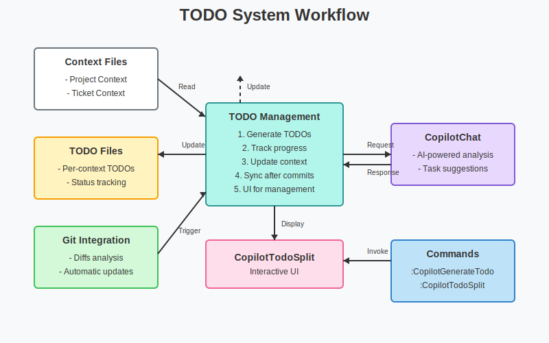

# TODO System Documentation

The TODO system in CopilotChatAssist provides a sophisticated way to manage tasks associated with specific contexts or tickets. This system leverages AI assistance to generate, update, and track tasks throughout the development process.

## Overview



The TODO system consists of several key components:

1. **Context-aware TODO files**: Each context/ticket can have its own associated TODO file.
2. **Interactive UI**: A split window interface for viewing and managing tasks.
3. **AI integration**: Uses CopilotChat to generate and update tasks based on context.
4. **Git integration**: Automatically updates TODOs based on recent changes.
5. **Progress tracking**: Monitors task status and completion percentage.

## Core Features

### Context-Based TODOs

TODO files are associated with specific contexts or tickets, allowing for granular task tracking:

- Each context gets its own TODO file with a dynamically generated name
- Tasks are specific to the context they belong to
- Context switching automatically loads the corresponding TODO file
- Tasks are updated based on context changes and git diffs

### Task Structure

Tasks are structured in a markdown table format with the following attributes:

| Attribute  | Description |
|------------|-------------|
| Number     | Sequential identifier |
| Status     | Current state (TODO, IN PROGRESS, DONE) |
| Priority   | Numerical priority (1-5, with 1 being highest) |
| Category   | Task category (e.g., documentation, core, testing) |
| Title      | Short descriptive title |
| Description| Detailed task description |

Example TODO format:
```markdown
| #  | status      | Priority | category      | title                    | description                                         |
|----|-------------|----------|---------------|--------------------------|----------------------------------------------------|
| 1  | IN PROGRESS | 1        | core          | Implement feature X      | Add support for X with Y and Z integration         |
| 2  | TODO        | 3        | documentation | Document API changes     | Update API documentation to reflect recent changes |
| 3  | DONE        | 2        | testing       | Add unit tests           | Create comprehensive unit tests for module A       |

**Total tasks:** 3
**Total pending:** 1
**Total in progress:** 1
**Total completed:** 1
**% progress:** 33%
```

### Interactive UI (CopilotTodoSplit)

The TODO split window provides an intuitive interface for managing tasks:

- Color-coded priorities
- Status indicators
- Keyboard shortcuts for common operations

#### Keyboard Shortcuts

| Key      | Function |
|----------|----------|
| `<CR>`   | View task details |
| `r`      | Refresh task list |
| `f`      | Filter by status (all, pending, in_progress, done) |
| `p`      | Filter by priority (1-5) |
| `s`      | Change task status |
| `i`      | Implement selected task |
| `?`      | Show help |
| `q`      | Close window |

### Task Generation and Updates

Tasks are generated and updated through several mechanisms:

1. **Initial generation**: Based on context files (project and ticket context)
2. **Manual refresh**: User-initiated via `:CopilotGenerateTodo` or pressing `r` in the TODO window
3. **Git-based updates**: Analyzing diffs to suggest new tasks or update existing ones
4. **Status updates**: User changing task status in the UI

## Commands

| Command | Description |
|---------|-------------|
| `:CopilotGenerateTodo` | Generate or update TODO file from context |
| `:CopilotTodoSplit` | Open TODO in split window |

## Implementation Details

### Task Generation

The task generation process involves:

1. Reading context information from context files
2. Combining with existing TODOs (if any)
3. Sending a prompt to CopilotChat with:
   - Project context
   - Ticket context
   - Existing TODO items
   - Recent git changes
4. Processing the response to create a structured TODO file

```lua
-- Example: Generate TODO
function M.generate_todo(callback)
  -- Read context information
  local paths = get_paths()
  local requirement = file_utils.read_file(paths.requirement) or ""
  local ticket_synthesis = file_utils.read_file(paths.synthesis) or ""
  local project_synthesis = file_utils.read_file(paths.project_context) or ""
  local todo = file_utils.read_file(paths.todo_path) or ""
  local full_context = requirement .. "\n" .. ticket_synthesis .. "\n" .. project_synthesis

  -- Generate prompt for CopilotChat
  local prompt = require("copilotchatassist.prompts.todo_requests").default(
    full_context, ticket_synthesis, todo
  )

  -- Send request to CopilotChat
  copilot_api.ask(prompt, {
    headless = true,
    callback = function(response)
      -- Process and write the response
      -- ...
    end
  })
end
```

### Internationalization Support

The TODO system supports multiple languages through the i18n system:

- UI elements adapt to the configured language
- Task generation prompts are adjusted based on language settings
- Status labels are translated accordingly

### Task Implementation Integration

The TODO system integrates with the patches system to implement tasks:

1. User selects a task and presses `i`
2. System generates a prompt for CopilotChat to implement the task
3. CopilotChat generates code with patch metadata
4. Patches are extracted and presented for review
5. User can apply patches to implement the task
6. Task status is automatically updated to "in_progress" if it was pending

## Configuration

The TODO system can be configured through the plugin's setup function:

```lua
require('copilotchatassist').setup({
  -- TODO-specific settings
  todo_split_orientation = "vertical", -- or "horizontal"

  -- Color highlighting for TODOs by priority
  todo_highlights = {
    "TodoHighPriority",    -- Priority 1 (highest)
    "TodoHighPriority",    -- Priority 2
    "TodoMediumPriority",  -- Priority 3
    "TodoLowPriority",     -- Priority 4
    "TodoLowPriority",     -- Priority 5 (lowest)
  },
})
```

## Best Practices

1. **Regular updates**: Refresh the TODO list regularly to keep it in sync with your progress
2. **Consistent status tracking**: Update task status as you work to maintain accurate progress metrics
3. **Prioritization**: Use the priority field to focus on the most important tasks first
4. **Categorization**: Use consistent categories to organize related tasks
5. **Concise titles**: Keep task titles brief and descriptive, with details in the description field

## Troubleshooting

### Common Issues

1. **TODO file not updating**: Ensure the context files exist and are properly formatted
2. **Missing tasks**: Check that the git repository is properly configured and accessible
3. **Empty TODO window**: Verify the TODO file exists and has valid content
4. **Status not changing**: Make sure the task format is correct and the status field is recognized

### Debugging

Set the log level to DEBUG for more detailed information:

```lua
require('copilotchatassist').setup({
  log_level = "DEBUG",
})
```

Log files are stored in the Neovim cache directory:
- `/Users/<username>/.cache/nvim/copilotchatassist/last_prompt.txt`
- `/Users/<username>/.cache/nvim/copilotchatassist/response_raw.txt`